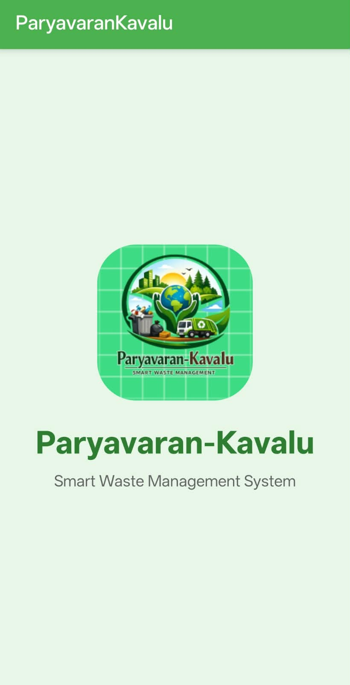
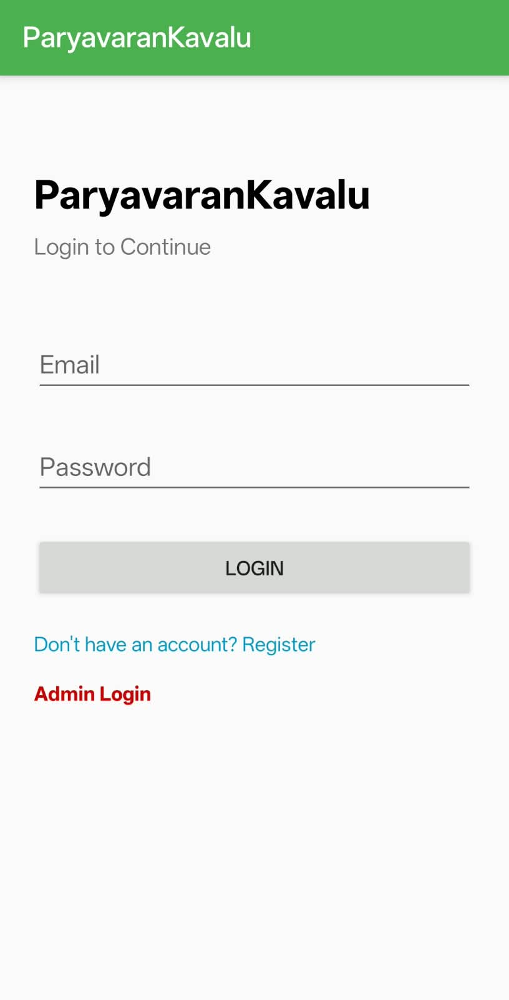
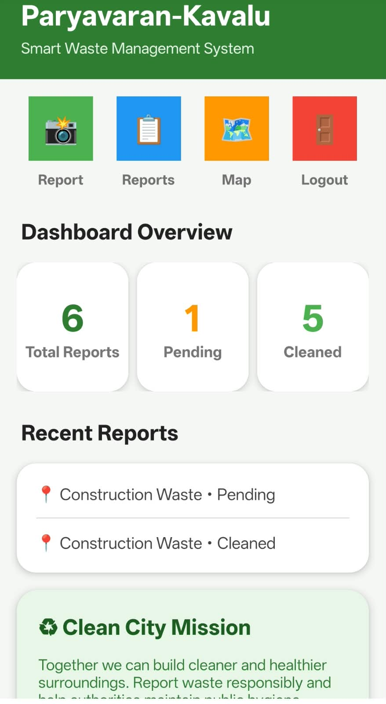
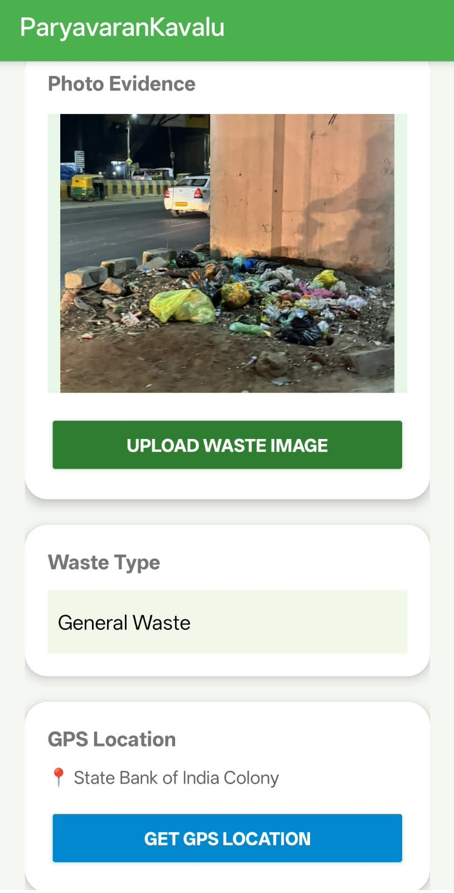
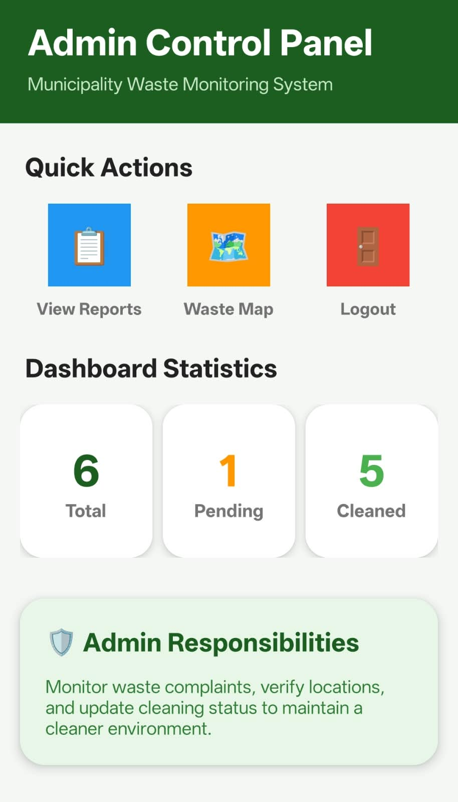
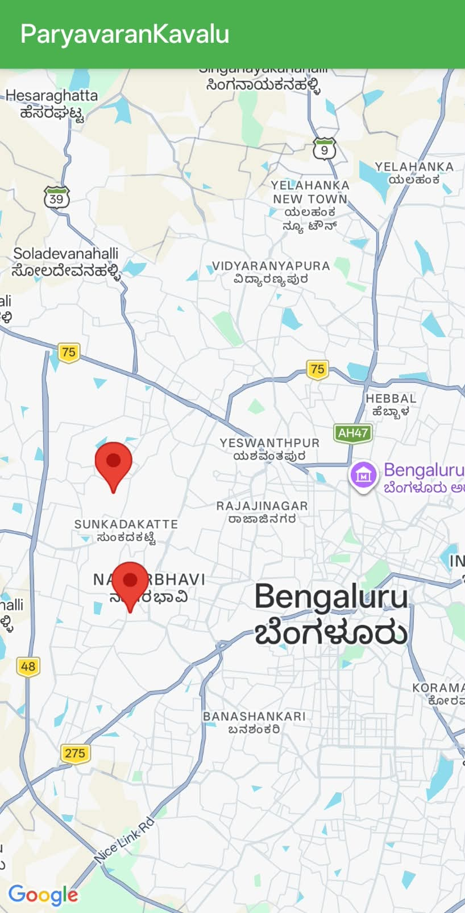

# Paryavaran-Kavalu

Paryavaran-Kavalu is an Android-based smart waste management application developed using Kotlin, Firebase, and Google Maps API. The application allows users to report waste issues by uploading images, descriptions, and live GPS locations. An admin module is included to monitor complaints and update their status as Pending or Cleaned.

## 🚀 Features

### 👤 User Module

- User registration and login
- Submit waste reports
- Upload waste images
- GPS location tracking
- View submitted reports
- Google Maps waste tracking
- Complaint status tracking
- Logout functionality

### 🔐 Admin Module

- Admin login
- View all complaints
- Monitor reported waste issues
- Mark complaints as cleaned
- Complaint monitoring dashboard
- Track pending and cleaned complaints

### 📍 Waste Location Tracking

- Capture GPS location for waste reports
- Display reported waste locations on Google Maps
- View multiple waste locations on the map

### 📸 Waste Reporting

- Upload photographic evidence of waste
- Select waste type
- Add waste descriptions
- Submit reports along with location information
- Track the status of submitted complaints

## 📸 Screenshots

### 🏠 App Home



### 🔑 User Login



### 📊 User Dashboard



### 📝 Waste Report Details



### 🛡️ Admin Dashboard



### 🗺️ Waste Location Map



## 🛠️ Tech Stack

### Android Development

- Kotlin
- Android Studio
- Android SDK

### Backend & Services

- Firebase
- Firebase Authentication
- Firebase Database / backend services
- Firebase Storage

### Maps & Location

- Google Maps API
- GPS / Location Services

### Development Tools

- Git
- GitHub
- Gradle

## 📂 Project Structure

```text
Paryavaran-Kavalu/
│
├── app/
│   └── Android application source files
│
├── gradle/
│
├── screenshots/
│   ├── home.png
│   ├── login.png
│   ├── user-dashboard.png
│   ├── report-details.png
│   ├── admin-dashboard.png
│   └── waste-map.png
│
├── build.gradle.kts
├── gradle.properties
├── gradlew
├── gradlew.bat
├── settings.gradle.kts
└── README.md